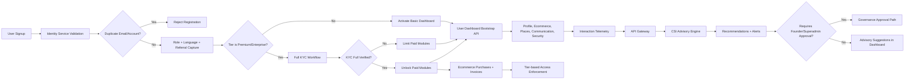

# Universal PULSCO User Dashboard

## Scope

This dashboard supports all user tiers (`basic`, `premium`, `enterprise`) with role-aware onboarding, localization, KYC-gated paid features, referral crediting, ecommerce/subscription management, communication, places/matchmaking, security controls, and CSI/PULSCO AI advisories.

## Delivery Planning

- See implementation backlog: `docs/dashboard-gap-backlog.md`
- See global hardening strategy: `docs/global-production-readiness-strategy.md`

## Confirmed Existing Architecture Used

- Monorepo workspace with `apps/*`, `services/*`, `packages/*`, and shared libraries.
- Existing microservice and gateway topology (`edge-gateway`, `pulse-intelligence-core`, billing, observability, firewall).
- CSI already modeled as advisory intelligence and gateway-mediated access.
- Identity/KYC service already enforces duplicate account and referral validation.

## Implemented Dashboard Backend Modules

API endpoints under `src/app/api/dashboard/*`:

- `bootstrap`: full snapshot aggregation.
- `onboarding`: role/language/referral updates.
- `profile`: profile updates and preference management.
- `subscription`: tier updates.
- `kyc`: KYC completion simulation for paid-tier unlock.
- `ecommerce`: product catalog + purchase action + invoices.
- `insights`: recommendations and alerts.
- `places`: nearby places + matchmaking data.
- `communication`: inbox/notifications/announcements + AI chatbot.
- `marketing`: campaign analytics (tier + consent gated).
- `security`: consent and compliance controls.
- `interactions`: CSI learning feed through API gateway only.
- `ops`: module metrics + automated backup snapshots.
- `localization`: localization-powered dashboard dictionary translation.
- `reporting`: revenue analytics, latency, and fraud anomaly views.
- `fraud`: dedicated risk score and anomaly feed.
- `identity`: 2FA/session/history identity controls.
- `billing`: subscription lifecycle + ledger/policy visibility.
- `places-ops`: place publishing and booking operations.
- `matchmaking-ops`: briefs, proposals, and contracts operations.
- `governance`: CSI approvals and MARP governance/arbitration visibility.
- `localization-advanced`: provider health and language coverage intelligence.
- `proximity-advanced`: proximity health/rules/metrics.

## Security and Compliance

- Sensitive fields are masked and hashed before dashboard exposure.
- CPC365/PC365 key material is used for snapshot signing (`CPC365_KEY` fallback to `PC_365_MASTER_TOKEN`).
- Consent-aware gates enforce marketing/location profiling behavior.
- Compliance profile attached per country (`gdpr`, `ccpa`, `global-default`).

## Billing Engine Source of Truth

- Billing-engine (`/marp/*`) is the authoritative source of truth for dashboard and planetary billing calculations.
- Ecommerce purchases are charged through `/marp/activity/charge` (`engine: ecommerce`), and recorded invoice totals mirror the billing ledger charge amount.
- Places booking operations are charged through `/marp/activity/charge` (`engine: places`) so dashboard transactions align with billing policy computations.
- Subscription lifecycle actions (`create`, `renew`, `upgrade`, `cancel`) call billing-engine endpoints with normalized plan, wallet, and region inputs.
- Product catalog pricing is synchronized from billing-engine plan catalog (`/marp/subscription/plans`) when available.
- Fee copy in checkout/payout forms now references active billing policy rather than fixed percentages.
- Core service charge paths now fail closed with `billing_engine_quote_failed`/`billing_engine_charge_failed` when billing-engine pricing is unavailable, preventing silent drift.

## Localization and Geocoding Integrations

- Dashboard text translation is powered through localization integration in `src/server/dashboard/localization-client.ts`.
- Translation resolution order:
  1. Internal Localization API (`PULSCO_LOCALIZATION_API_URL` / `LOCALIZATION_API_URL`)
  2. Internal CSI localization advisory path (`PULSCO_CSI_GATEWAY_URL` / `PULSCO_EDGE_GATEWAY_URL` / `PULSCO_MARP_FIREWALL_URL`)
  3. Built-in fallback dictionary
- External translation providers are disabled by default and require explicit opt-in (`ALLOW_EXTERNAL_TRANSLATION_PROVIDER=true`).
- Dashboard onboarding language input is no longer restricted to a fixed shortlist; it accepts any valid ISO language code and uses Localization+CSI coverage feeds for suggestions.
- Nearby places are now distance-ranked using geocoded user location from proximity integration in `src/server/dashboard/proximity-client.ts`.
- Geocoding endpoint uses `PULSCO_PROXIMITY_API_URL` / `PROXIMITY_API_URL` (default: `http://localhost:3002/api/v1/proximity`).

## PULSCO AI Availability in Dashboard

- Dashboard chatbot is powered by `src/server/dashboard/pulsco-ai-client.ts`.
- AI resolution order:
  1. `PULSCO_AI_API_URL` / `AI_COORDINATOR_URL` live endpoints
  2. Built-in PULSCO AI fallback mode for continuity
- UI exposes AI status/provider/mode in dashboard header area.

## CSI Guardrails

- Dashboard never imports CSI clients directly.
- CSI interactions are forwarded through gateway endpoint envs (`PULSCO_CSI_GATEWAY_URL`, `PULSCO_EDGE_GATEWAY_URL`, `PULSCO_MARP_FIREWALL_URL`).
- Advisory recommendations include `requiresApproval` and role gates (`superadmin`/`founder`).
- CSI remains non-autonomous.

## Flowchart



## Running and Testing

From repository root:

```bash
pnpm --filter pulse-connect-ui test
pnpm --filter pulse-connect-ui dev
```

Dashboard examples:

- `/dashboard?userId=demo-basic`
- `/dashboard?userId=demo-premium`
- `/dashboard?userId=demo-enterprise`
